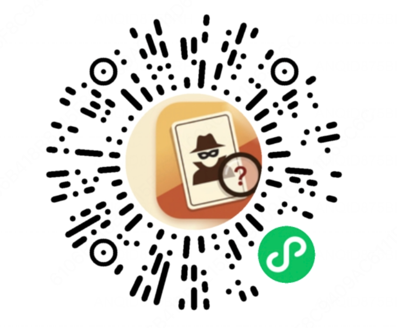

<div align="center">
  

  <h1>互动助手</h1>

  <p><strong>聚会小游戏合集，打开即玩。</strong></p>
  <p>内含「谁是卧底·拼音版」和「添笔成词」两款线下互动小游戏 —— 无需下载、无需注册、无需联网，适合小学生和家庭聚会。</p>

  <br />

  <a href="assets/miniprogram-qrcode.png">
    
  </a>

  <p><sub><strong>📱 微信扫一扫，立即开玩</strong></sub></p>
</div>

---

## 立即体验

打开微信 → **扫一扫** → 对准上方二维码，即可进入小程序。
也可以在微信内直接搜索小程序名「**谁是卧底·拼音版**」找到我们。

> 小程序完全本地运行，所有词库都打包在客户端，**无任何联网请求 / 无广告 / 无登录**。

## 包含的游戏

| 游戏 | 说明 |
| --- | --- |
| **谁是卧底·拼音版** | 3 ~ 12 人围坐传手机，找出拿到不同词语的那名卧底。所有词语均带标准拼音。 |
| **添笔成词** | 给左右两个字分别加几笔，猜出组成的词语。适合单人或两人一起动脑。 |

## 亮点

- **小学生也能看懂**：词语选自日常生活，避开生僻字和成人题材。
- **全词配拼音**（谁是卧底）：每一组词对都标注了标准普通话声调拼音，识字量不多的低年级小朋友也能独立阅读。
- **7 大词库 / 90 组词对**（谁是卧底）：大杂烩、童话、动物、水果蔬菜、学校生活、美食零食、运动游戏。
- **54 道添笔题**（添笔成词）：每题给出左右两个基础字和加笔数，附加笔说明。
- **智能去重**：两个游戏都会记录已出过的题目，随机抽题但不重复；题库出完后自动开始新一轮。
- **3 ~ 12 人线下游玩**（谁是卧底）：传手机查看卡牌即可，不需要投屏、联机或服务器。
- **完全本地运行**：无需注册、无需联网、无任何广告，打开即玩。
- **精心打磨的 UI**：暖米棕主题，翻牌 / 进度 / 揭晓都有细腻过渡。

## 谁是卧底 · 玩法三步走

1. **设置**：选择人数（3 ~ 12 人）和词库类别。
2. **传词**：手机依次传给每位玩家，点击自己的卡牌查看词语（仅自己能看）。大多数人拿到相同的词，**只有一名「卧底」**拿到一个相近但不同的词。
3. **投票 / 揭晓**：围坐轮流用一句话描述自己的词，再一起投票找出说得不一样的人，最后在小程序里点「揭开谜底」确认真相。

## 添笔成词 · 玩法

1. 阅读提示：给左字加 x 笔、右字加 y 笔，组成一个词。
2. 看题面两个字，在心里（或纸上）试加笔画、拼词。
3. 想好了点「查看答案」，不满意就点「换一题」。

## 题目去重机制

两个游戏共用一套去重逻辑，保证跨次打开也不重复出题：

```
打开 / 换题 → 读取本地已用记录 → 从未用池中随机抽一题 → 记入已用并写回存储
                                              ↓ 题库用尽
                                        清空已用记录，重新随机一轮
```

- **添笔成词**：全局共用 `strokeword:used_indices`，54 题轮转。
- **谁是卧底**：按词库分类独立记录（如 `undercover:used:mixed`），各分类互不影响。
- 核心逻辑在 [`utils/used-picker.js`](utils/used-picker.js)（纯函数，可单测），持久化在 [`utils/storage.js`](utils/storage.js)（`wx.setStorageSync`）。

## 预览

| 游戏大厅 | 谁是卧底 / 设置 | 添笔成词 |
| :---: | :---: | :---: |
| 两款游戏入口 | 人数 + 词库选择，翻牌揭晓 | 加笔猜词，查看答案 / 换一题 |

<sub>（建议在微信开发者工具里打开本项目直接预览真机效果。）</sub>

## 本地开发

### 依赖

- [微信开发者工具](https://developers.weixin.qq.com/miniprogram/dev/devtools/download.html)（**稳定版**，本项目以 `libVersion 3.15.2` 为准）
- Node.js ≥ 18（仅用于跑单元测试，小程序运行本身不需要 Node）

### 打开项目

1. 克隆本仓库：

   ```bash
   git clone git@github.com:CoderLim/find-the-undercover.git
   cd find-the-undercover
   ```

2. 打开微信开发者工具 → **导入项目**：

   - **项目目录**：选本仓库根目录
   - **AppID**：填你自己的小程序 AppID（或点「测试号」快速体验）
   - **不使用云服务**

3. 工具加载完成后会自动编译，左侧模拟器即为游戏大厅。

### 跑单元测试

游戏核心逻辑（发牌 / 翻牌 / 揭晓 / 去重抽题）都有单元测试覆盖：

```bash
npm test
```

等价于 `node --test tests/*.test.js`，目前 10 个用例全部通过，不依赖小程序运行时。

### 重新生成图标

图标分两层：

| 文件 | 用途 |
| --- | --- |
| `app-icon.png` | **小程序主图标**（互动助手平台，2×2 游戏格 + 「+」） |
| `undercover-icon.png` | 谁是卧底 · 大厅入口图标 |
| `strokeword-icon.png` | 添笔成词 · 大厅入口图标 |

生成小程序主图标：

```bash
python3 -m pip install --user --break-system-packages Pillow
python3 scripts/build-hub-icon.py
```

脚本会产出 `app-icon.png`（144×144）、`app-icon-144.png`、`app-icon-288.png` 三份。

## 目录结构

```
find-the-undercover/
├── app.js / app.json / app.wxss     小程序全局入口与主题变量
├── pages/
│   ├── home/                        游戏大厅：谁是卧底 + 添笔成词入口
│   ├── index/                       谁是卧底：设置面板 + 玩法提示
│   ├── play/                        谁是卧底：状态栏 + 卡片网格 + 揭晓面板
│   └── strokeword/                  添笔成词：玩法说明 + 游戏页
├── components/
│   ├── setup-panel/                 人数 / 词库选择
│   ├── player-card-grid/            2 列卡牌网格，含翻面样式
│   └── reveal-panel/                揭晓面板（按钮 + 真相卡）
├── data/
│   ├── word-bank.js                 7 大词库 / 90 组词对（含拼音）
│   └── puzzles.js                   添笔成词题库（54 题）
├── utils/
│   ├── game.js                      谁是卧底：发牌 / 翻牌 / 揭晓 / 重置
│   ├── used-picker.js               通用去重抽题（从未用池随机，用尽重置）
│   └── storage.js                   已用题目本地存储读写
├── tests/
│   ├── game.test.js                 谁是卧底逻辑测试
│   └── used-picker.test.js          去重抽题逻辑测试
├── assets/                          图标与视觉素材
├── scripts/
│   ├── build-hub-icon.py            小程序主图标生成（互动助手）
│   └── build-app-icon.py            旧版卧底图标裁剪脚本（保留备用）
└── docs/                            设计文档与规划
```

## 词库一览（谁是卧底）

| id | 名称 | 词对数 | 示例 |
| --- | --- | ---: | --- |
| `mixed` | 大杂烩 | 13 | 苹果 / 梨、床 / 沙发、雨伞 / 帽子 |
| `fairy` | 童话 | 13 | 白雪公主 / 灰姑娘、孙悟空 / 猪八戒 |
| `animals` | 动物 | 13 | 熊猫 / 考拉、蝴蝶 / 蜻蜓、鸭子 / 大鹅 |
| `fruits` | 水果蔬菜 | 13 | 西瓜 / 哈密瓜、胡萝卜 / 白萝卜 |
| `school` | 学校生活 | 13 | 铅笔 / 钢笔、课桌 / 椅子、语文 / 数学 |
| `food` | 美食零食 | 13 | 饺子 / 包子、冰淇淋 / 雪糕、棒棒糖 / 棉花糖 |
| `sports` | 运动游戏 | 12 | 篮球 / 足球、跳绳 / 踢毽子、捉迷藏 / 老鹰捉小鸡 |

共 **90 组**词对，每组都附标准声调拼音，例如：

```js
{
  commonWord: '熊猫',
  commonPinyin: 'xióng māo',
  undercoverWord: '考拉',
  undercoverPinyin: 'kǎo lā',
}
```

## 贡献

欢迎补充更多小学生友好的词对、新主题词库，或添笔成词新题目。提 PR 前请：

1. 新词对必须**两两相近**（同类目中的近亲，否则游戏会失去悬念）。
2. 用词优先小学一二年级就能理解的常见词。
3. 拼音必须带正确声调，可用 [汉典](https://www.zdic.net/) 或输入法的拼音标注功能校对。
4. 添笔成词新题须遵守 [`data/puzzles.js`](data/puzzles.js) 文件头部的出题规范（加笔数 1~3、词语具体形象、`word` 不与已有题目重复等）。
5. 运行 `npm test` 确认结构未破坏。

## 许可

本项目仅供个人学习与聚会娱乐使用，未包含任何商业授权素材。
